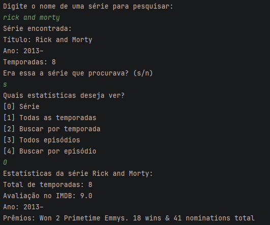

# Aprendizados deste projeto:
- Consumo de api (Obmd API) usando classes HTTP (client, request e response)
- Gerenciamento de dependências com Maven
- Desserialização de json utilizando a biblioteca **Jackson**
- Tratamento de Excessões
- Collections
- Streams API
- Expressões Lambda
- Regex (Regular Expressions)
- MVC Architecture

